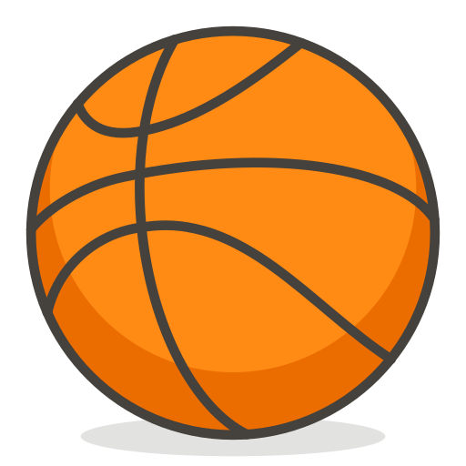

<h1>Memoria del proyecto fin de evaluación de Lenguajes de Marcas - 1º DAM</h1>
<h2>B-Academy</h2>
<h2>Indice</h2>
<ul>
  <li><a href="#introduccion">Introducción</a></li>
  <li><a href="#motivacion">Motivación</a></li>
  <li><a href="#estructura">Estructura</a></li>
  <li><a href="#estilo">Estilo</a></li>
</ul>

<h2 id="introduccion">Introducción</h2>

Trabajo realizado en clase por: Iván Caro Romero

Proyecto de web "from scratch" de 1ª evaluación de Lenguajes de Marcas

Diciembre de 2023 

Licencia CC-BY

<h2 id="motivacion">Motivación</h2>

El tema lo he elegido porque me gusta el baloncesto y he querido crear algo innovador sin inspirarme en ninguna empresa ya creada para desarrollar más fácilmente mis conceptos.

<h2 id="estructura">Estructura</h2>

La web está dividida en 5 secciones:

<ul>
  <li>Hero Section</li>  
  <li>Merchandising</li>
  <li>Tournaments</li>
  <li>Contact</li>
  <li>Footer</li>
</ul>

<h3>Hero Section</h3>

He utilizado una imagen de fondo tomada de la página 3x3series.com que se adapta fácilmente a diferentes dispositivos como tablet, móvil y ordenador. 
Sobre ella he colocado un Call to Action que he estilado a partir de un botón con animación para llamar la atención del visitante fácilmente. 

<h3>Merchandising</h3>

He dispuesto en un grid de 4 columnas conformado por 4 imagenes de el merchandising, este grid pasa a ser de 2 columnas cuando la página baja de 600 px y a ser de 1 columna cuando baja de 300 px.

<h3>Tournaments</h3>

He dispuesto un grid de 1 columna conformado por dos imágenes con texto sobre los torneos que se disputan.

<h3>Contanct</h3>

Esta sección consta de un mapa interactivo con la localización de mi local y una zona de enlaces a mis redes sociales dispuesto todo lo anterior en un grid de 2.

<h3>Footer</h3>

En el footer tan solo he repetido la barra de navegación para tener un fácil acceso a las secciones desde los enlaces internos de la página. 

<h2 id="estilo">Estilo de la página</h2>
<h3>La paleta de colores se ha divido en:</h3>

rgb(255, 186, 57)
   rgb(91, 200, 200)
   rgb(49, 131, 131)

<h3>Tipografías</h3>

font-family: Arial, sans-serif

<h3>Imágenes</h3>

  
  
  
  
  
  
  
  
  
  
  
  
  
  

<h2 id="snippets">Code snippets</h2>

He utilizado los siguientes:

<ul>
  <li>Barra de navegación: creada a mano por mi</li>
</ul>
